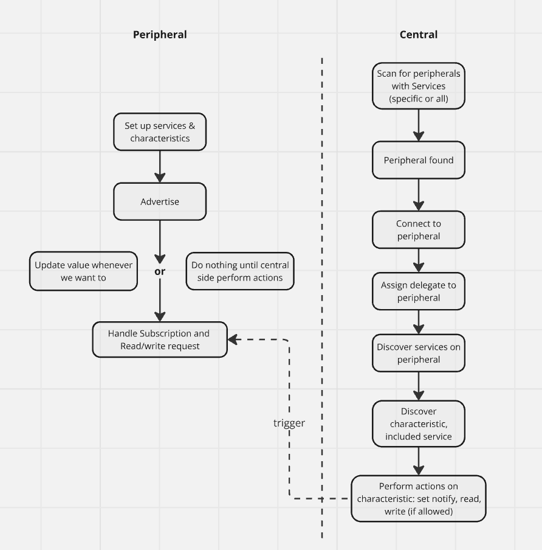
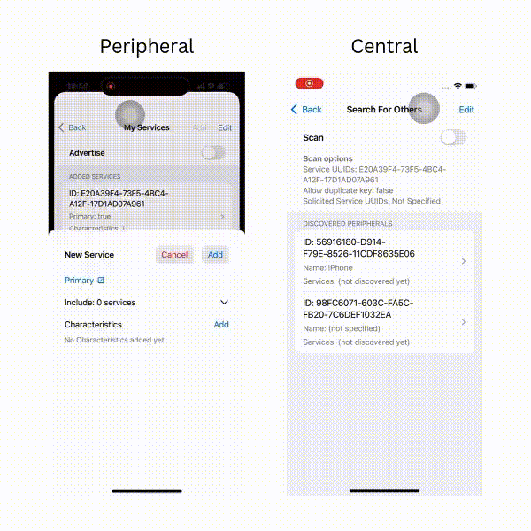

# Bluetooth low energy App in SwiftUI

## Peripheral Side Implementation
- Create services, characteristics with descriptors
- Advertising
- update characteristic value dynamically
- Handle subscription, write and read request from the Central
- Peripheral manager state preservation and restoration (previous added services/characteristic, subscribed centrals)

## Central Side Implementation
- Scanning for peripherals
- Connect to peripherals
- Discover services, characteristics, included services, and descriptors
- subscribe to characteristics, read and write values
- Central manager state preservation and restoration (previous connected services, scanning options)

For more details on the implementation, please check out my blogs
- [SwiftUI: Low Energy Bluetooth (Part1: Peripheral Side)](https://medium.com/@itsuki.enjoy/swiftui-low-energy-bluetooth-part1-peripheral-side-0c772ef478d0)
- [SwiftUI: Low Energy Bluetooth (Part2: Central Side)](https://medium.com/@itsuki.enjoy/swiftui-low-energy-bluetooth-part2-central-side-1f3148217334)

